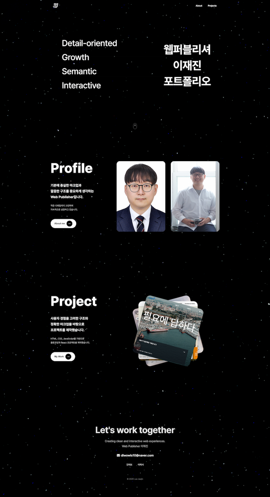
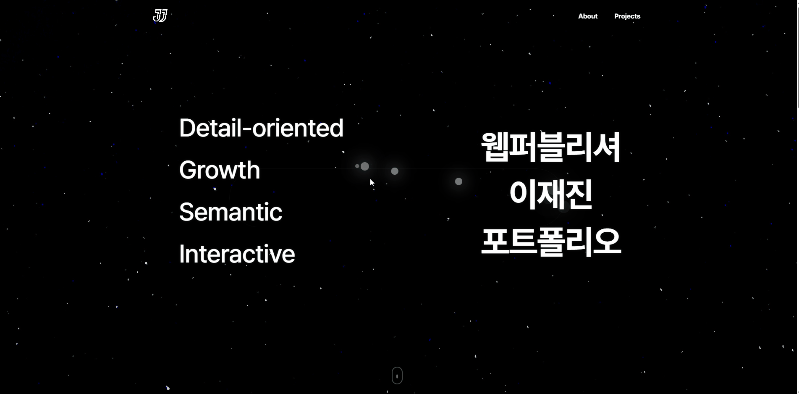
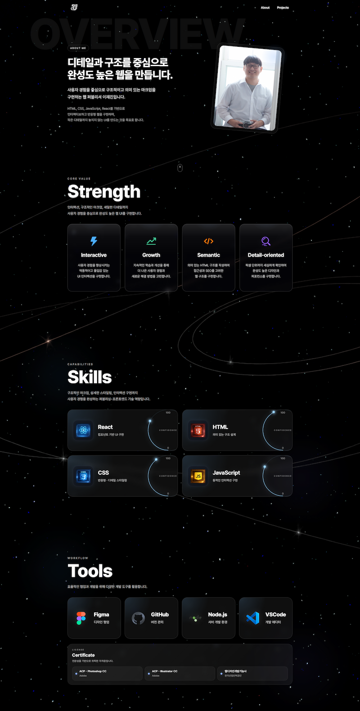
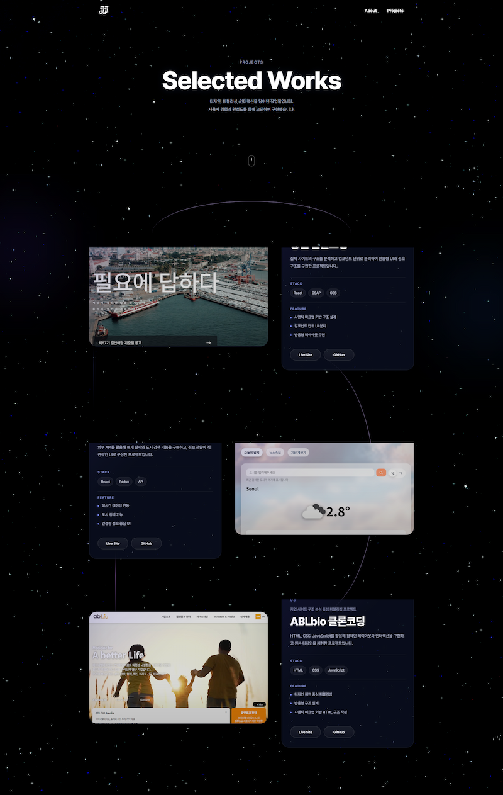

# Portfolio

개인 프로젝트와 프론트엔드 구현 역량을 정리한 포트폴리오 웹사이트입니다.  
React를 기반으로 제작했으며, 인터랙션 중심의 UI와 반응형 레이아웃, 사용자 경험을 고려한 화면 전환에 집중했습니다.

## 배포 주소

- Live Site: https://ljj5928.github.io/portfolio
- GitHub: https://github.com/ljj5928/portfolio

---

## 📌 프로젝트 소개

이 프로젝트는 저의 작업물과 구현 역량을 한눈에 보여주기 위한 포트폴리오 웹사이트입니다.  
단순히 프로젝트 목록을 나열하는 것이 아니라, 메인 비주얼부터 각 섹션의 흐름과 인터랙션까지 하나의 완성된 브랜드 사이트처럼 보이도록 구성했습니다.

특히 다음 요소를 중심으로 작업했습니다.

- 섹션 단위 컴포넌트 분리
- 반응형 레이아웃 구성
- 스크롤 기반 인터랙션 구현
- 데이터 매핑 기반 UI 렌더링
- 사용자 행동에 반응하는 동적 인터페이스 설계
- 유지보수를 고려한 페이지 구조 설계

---

## 🎯 프로젝트 목표

- 포트폴리오를 하나의 웹 경험으로 완성도 있게 구성하기
- React 기반 컴포넌트 설계와 상태 관리를 실제 UI에 적용하기
- 반응형 대응을 통해 다양한 디바이스 환경에서도 자연스럽게 보이도록 만들기
- 인터랙션 요소를 활용해 정적인 소개 페이지가 아닌 몰입감 있는 화면 흐름 구현하기
- 유지보수하기 쉬운 구조로 정리해 추후 프로젝트 추가 및 수정이 용이하도록 만들기

---

## 🖼 Preview

### Home
메인 페이지는 `Hero / Profile / Project / Contact` 섹션으로 구성되어 있으며,  
첫 진입부터 프로젝트 소개와 연락까지 자연스럽게 이어지는 흐름을 중심으로 설계했습니다.



---

### Header
스크롤 방향, 특정 섹션 진입 여부, hover 상태에 따라 스타일이 동적으로 변화하는 헤더입니다.

- 스크롤 다운 시 헤더 숨김
- 스크롤 업 시 헤더 재노출
- hover 상태에 따라 배경과 텍스트 스타일 변경


---

### Profile Section
프로필 소개와 함께 텍스트 리빌 애니메이션, 커스텀 커서 인터랙션을 적용한 섹션입니다.

- `IntersectionObserver` 기반 텍스트 등장 애니메이션
- 마우스 움직임을 따라가는 커스텀 커서 구현
- `requestAnimationFrame`을 활용한 부드러운 좌표 추적
- About 페이지로 자연스럽게 연결되는 CTA 구성



---

### About
자기소개, 강점, 기술, 사용 도구 및 자격증까지 단계적으로 보여주는 소개 페이지입니다.

- `Overview / Strength / Skill / Tools` 섹션 분리
- 대형 타이포그래피와 비주얼 프레임을 활용한 인트로 연출
- 카드형 UI를 활용한 핵심 역량 정리
- 스킬 레벨을 시각화한 오비트 UI 구현



---

### Projects
대표 프로젝트를 카드 UI로 정리한 페이지입니다.

- 프로젝트 데이터 배열 기반 렌더링
- 카드 진입 방향을 다르게 적용한 인터랙션
- Stack / Feature / Live / GitHub 정보 구조화
- 반응형 레이아웃과 시각적 강조를 고려한 카드 디자인



---

## ✨ 주요 기능

### 1. 동적 Header UI
스크롤 방향과 특정 섹션 위치를 감지해 Header가 자동으로 숨겨지거나 다시 나타나도록 구현했습니다.  
또한 hover 상태에 따라 로고와 텍스트 색상이 전환되도록 설계해 사용자 경험을 개선했습니다.

### 2. 전역 마우스 파티클 인터랙션
마우스 이동에 반응하는 파티클 효과를 전역에서 적용했습니다.

- 좌표 기반 파티클 생성
- 일정 시간 후 자동 제거
- 생성 간격 제한을 통한 과도한 렌더링 방지
- 최근 파티클만 유지해 성능 최적화

### 3. 스크롤 기반 애니메이션
페이지 내 여러 섹션에 `IntersectionObserver`를 적용해 요소가 뷰포트에 진입할 때 자연스럽게 등장하도록 구현했습니다.

### 4. 커스텀 커서 인터랙션
Profile 섹션의 이미지 영역에서 마우스를 따라 움직이는 커스텀 커서를 구현해 시각적인 몰입감을 높였습니다.

### 5. 데이터 기반 렌더링
Projects, Strength, Tools 등 반복되는 UI를 데이터 배열 기반으로 구성해 유지보수성과 확장성을 높였습니다.

### 6. 반응형 레이아웃
데스크톱, 태블릿, 모바일 환경에 맞게 레이아웃과 타이포그래피를 조정해 다양한 화면 크기에서도 자연스럽게 보이도록 구현했습니다.

---

## 🧩 구현 포인트

### 1. 페이지 구조 설계
프로젝트는 `Home`, `About`, `Projects` 페이지로 나누고, 각 페이지를 다시 `sections` 단위로 세분화했습니다.  
이를 통해 페이지 단위 책임 분리와 섹션 단위 유지보수가 가능하도록 구조를 설계했습니다.

### 2. 상태 기반 인터페이스 제어
Header는 단순 고정 UI가 아니라, 현재 스크롤 방향과  hover 상태에 따라 다르게 반응하도록 구현했습니다.  
상태 기반 UI 제어를 통해 정적인 화면이 아니라 사용자 행동에 반응하는 인터페이스를 만들고자 했습니다.

### 3. 성능을 고려한 인터랙션 처리
전역 파티클 효과와 커스텀 커서 구현 시 불필요한 렌더링을 줄이기 위해 다음과 같은 방식을 적용했습니다.

- 파티클 생성 간격 제한
- 최근 파티클 개수 제한
- `setTimeout` 정리 로직으로 메모리 누수 방지
- `requestAnimationFrame` 기반 좌표 업데이트

### 4. 데이터 기반 카드 UI 구성
Projects 페이지와 About 페이지 일부 섹션은 배열 데이터를 기반으로 렌더링되도록 구성했습니다.  
프로젝트 추가나 수정 시 UI 구조를 크게 변경하지 않고도 확장 가능하도록 설계했습니다.

### 5. 시각적 완성도를 위한 스타일링
배경 오브젝트, glow 효과, blur, overlay, glassmorphism 스타일을 적극 활용해  
단순 정보 전달용 페이지가 아니라 하나의 브랜드형 포트폴리오 사이트처럼 보이도록 연출했습니다.

### 6. 스킬 시각화 UI 구현
About 페이지의 Skill 섹션에서는 스킬 숙련도를 단순 텍스트가 아닌 오비트 형태의 시각화 UI로 구현했습니다.  
CSS custom properties를 활용해 각 카드의 각도, 진행값, 애니메이션 딜레이를 제어했습니다.

---

## 🛠️ 기술 스택

### Frontend
- React
- JavaScript
- CSS
- React Router

### Build Tool
- Vite

### Library / Tool
- Font Awesome

---

## 📄 페이지 구성

### Home
- Hero
- Profile
- Project
- Contact

메인 페이지에서는 첫인상, 간단한 자기소개, 대표 프로젝트, 연락 정보까지 한 흐름 안에서 보여주도록 구성했습니다.

### About
- Overview
- Strength
- Skill
- Tools

자기소개를 단순 텍스트로 끝내지 않고, 강점과 기술, 사용 도구, 자격증까지 단계적으로 보여주는 구조로 설계했습니다.

### Projects
- ProjectHero
- ProjectList
- ProjectCard

대표 프로젝트를 카드 형태로 정리하고, Live Site와 GitHub 링크를 함께 제공해 실제 작업 결과와 코드를 모두 확인할 수 있도록 구성했습니다.

---

## 📁 프로젝트 구조

```bash
src/
├── assets/
│
├── portfolio/
│   ├── Components/
│   │   ├── Header.css
│   │   ├── Header.jsx
│   │   ├── ScrollIndicator.css
│   │   ├── ScrollIndicator.jsx
│   │   └── ScrollToTop.jsx
│   │
│   ├── Pages/
│   │   ├── about/
│   │   │   ├── sections/
│   │   │   │   ├── overview/
│   │   │   │   ├── skill/
│   │   │   │   ├── strength/
│   │   │   │   └── tool/
│   │   │   ├── About.css
│   │   │   └── About.jsx
│   │   │
│   │   ├── home/
│   │   │   ├── sections/
│   │   │   │   ├── contact/
│   │   │   │   ├── hero/
│   │   │   │   ├── profile/
│   │   │   │   └── project/
│   │   │   ├── Home.css
│   │   │   └── Home.jsx
│   │   │
│   │   ├── projects/
│   │   │   ├── hero/
│   │   │   ├── List/
│   │   │   └── Projects.jsx
│   │   │
│   │   ├── App.css
│   │   └── App.jsx
│
└── main.jsx
```

##⚠️ 안내 사항
- 본 프로젝트는 포트폴리오 사이트로 제작되었으며, 개인 작업물 소개를 목적으로 구성했습니다.
- 일부 이미지 및 미리보기 화면은 README 전용 캡처 이미지로 교체될 수 있습니다.
- 프로젝트 링크는 배포 환경에 따라 경로나 이미지가 일부 다르게 보일 수 있습니다.
- HashRouter를 사용해 GitHub Pages 환경에서도 라우팅이 가능하도록 구성했습니다.

## 📞 Contact

- GitHub: https://github.com/ljj5928
- Email: dlwowls10@naver.com